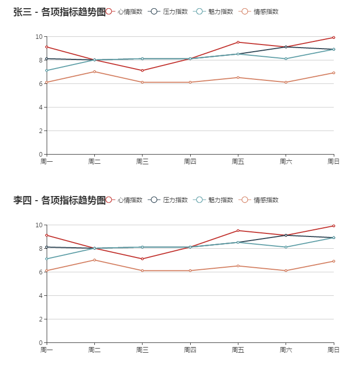

## 说明

一个用于格式化输出的python脚本。

- outlib.py：一个用于格式化输出的库；
- js/*: 用于格式化输出的js文件；


### 输入

```
axisX=['周一', '周二', '周三', '周四', '周五','周六', '周日']
dataList=[
{
    '心情指数': [9.1, 8, 7.1, 8.1, 9.5, 9.1, 9.9],
    '压力指数': [8.1, 8, 8.1, 8.1, 8.5, 9.1, 8.9],
    '情感指数': [6.1, 7, 6.1, 6.1, 6.5, 6.1, 6.9],
    '魅力指数': [7.1, 8, 8.1, 8.1, 8.5, 8.1, 8.9]
},
{
    '心情指数': [9.1, 8, 7.1, 8.1, 9.5, 9.1, 9.9],
    '压力指数': [8.1, 8, 8.1, 8.1, 8.5, 9.1, 8.9],
    '情感指数': [6.1, 7, 6.1, 6.1, 6.5, 6.1, 6.9],
    '魅力指数': [7.1, 8, 8.1, 8.1, 8.5, 8.1, 8.9]
}]
title=["张三 - 各项指标", "李四 - 各项指标"]
outfile="./out.html"
```


### 输出

输出的结果是一张html页面[[链接]](http://www.csuldw.com/WorkUtils/show/data_visulization.html)，内容如下：





